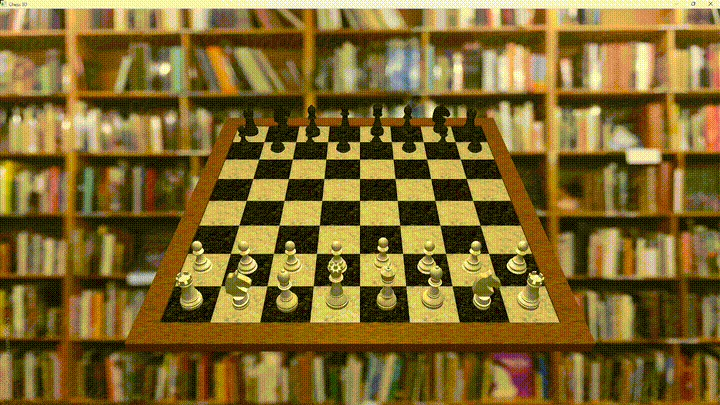

# Chess 3D — Computação Gráfica

Visualização de uma cena 3D de xadrez implementada em C++ com OpenGL 3.3 Core Profile.



## Tecnologias

- **Linguagem:** C++
- **API Gráfica:** OpenGL 3.3 Core Profile
- **Bibliotecas:** GLEW, GLFW, GLM

## Como compilar e executar

**Instalar dependências (Ubuntu/Debian):**
```bash
sudo apt install libglew-dev libglfw3-dev libglu1-mesa-dev
```

**Compilar:**
```bash
g++ main.cpp -o chess -lGL -lGLEW -lglfw -lGLU
```

**Executar:**
```bash
./chess
```

## Interação

| Tecla | Ação |
|-------|------|
| `R` | Reseta o cenário |
| `Espaço` | Dispara a animação do Mate do Pastor |
| `C` | Alterna a câmera entre a perspectiva das brancas e das pretas enquanto a animação não está em andamento |
| `ESC` | Fecha a aplicação |

## Especificações atendidas

### Objetos 3D com posicionamento e escala individuais

O tabuleiro é construído com cubos unitários redimensionados via `glm::scale` e posicionados via `glm::translate`. As peças são carregadas de arquivos `.obj` e cada uma tem sua própria matriz Model com posição e escala aplicadas individualmente:

### Shader próprio

Os shaders GLSL estão em `vertex_shader.glsl` e `fragment_shader.glsl`, implementados do zero sem uso de pipeline de função fixa. O fragment shader aplica o modelo de iluminação **Phong** com três componentes: ambiente, difusa e especular.

### Duas câmeras

Duas posições de câmera são definidas via `glm::lookAt` e alternadas com a tecla `C`:

- **Câmera das brancas:** posição `(4, 8, 14)`, olhando para o centro do tabuleiro
- **Câmera das pretas:** posição `(4, 8, -6)`, olhando para o centro do tabuleiro pelo lado oposto

### Iluminação

A iluminação é feita pelo shader `fragment_shader.glsl`, o qual aplica o modelo de Phong. A cor da luz é definida pelo valor (1.0, 0.9, 0.6), apresentando uma coloração alaranjada morna. A luz possui os seguintes componentes:

- **Luz ambiente**: multiplica a cor da luz por 0.4 para garantir sombras suaves.

- **Luz difusa**: calculada medindo o ângulo de incidência (produto escalar) entre a direção da luz e a normal da superfície iluminada. Tem sua intensidade final modulada dinamicamente pela variável `intensidadeDifusa`, fornecida pelo código em C++.

- **Luz especular**: o grau de reflexo e a dispersão da luz são fornecidas pelo código em C++ por meio das variáveis `brilhoMaterial` e `focoBrilho`.

- **Luz da câmera**: emissão de luz acinzentada fraca na direcão de visão do observador. Melhora a percepção de profundidade dos objetos.

### Movimento de objeto

Foi implementada uma animação de Mate do Pastor, na qual são movidos: um peão branco, um peão preto, a rainha branca, os dois cavalos pretos, um bispo branco, e o rei preto.

O movimento é controlado por uma máquina de estados (passoAtual) que utiliza interpolação linear para as coordenadas X e Z. Para simular o levantamento das peças, é aplicada uma função de deslocamento no eixo Y (alturaAnim), criando um efeito de "salto" enquanto a peça se desloca entre as casas.

A animação é iniciada ao pressionar a tecla `Espaço`, com cada passo da sequência sendo processado automaticamente.

### Textura

O carregamento de texturas é feito via biblioteca `stb_image.h`.

- **Tabuleiro e Peças**: As texturas de mármore (`marble.jpg`, `blackmarble.jpg`, etc.) são aplicadas alternadamente, gerando quadrados brancos e pretos. O mapeamento UV é passado através dos buffers de vértices dos modelos `.obj`.

- **Background**: Uma textura de ambiente (`biblioteca.jpg`) é mapeada em um retângulo de fundo atrás da cena.

É feito uso de Filtro Anisotrópico para melhorar a nitidez das texturas em ângulos rasos (comum na visualização do tabuleiro), e mapeamento `GL_REPEAT` para as casas do tabuleiro e `GL_LINEAR_MIPMAP_LINEAR` para transições suaves entre diferentes níveis de detalhe (Mipmaps).

---

## Estrutura do projeto

```
├── bg_fragment_shader.glsl
├── bg_vertex_shader.glsl
├── fragment_shader.glsl
├── jogo.gif
├── main.cpp
├── models/
│   ├── bishop.obj
│   ├── chessKitExport.obj
│   ├── king.obj
│   ├── knight.obj
│   ├── pawn.obj
│   ├── queen.obj
│   └── rook.obj
├── stb_image.h
├── textures
│   ├── biblioteca.jpg
│   ├── blackmarble.jpg
│   ├── blackmetal.jpg
│   ├── marble.jpg
│   ├── onyx.jpg
│   └── wood.jpg
└── vertex_shader.glsl
```
